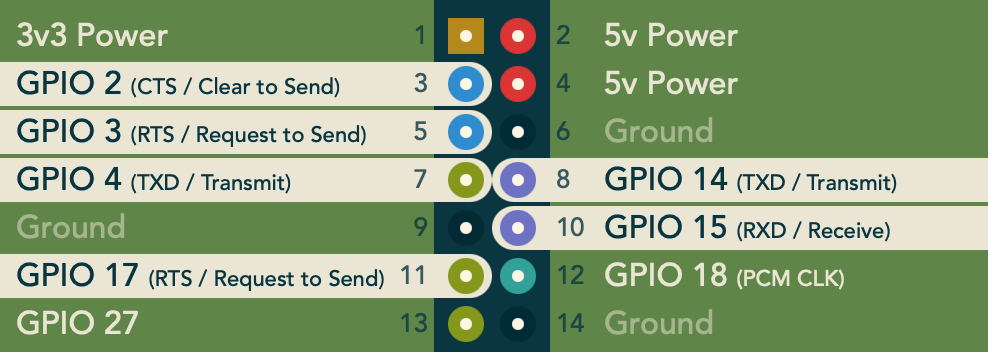
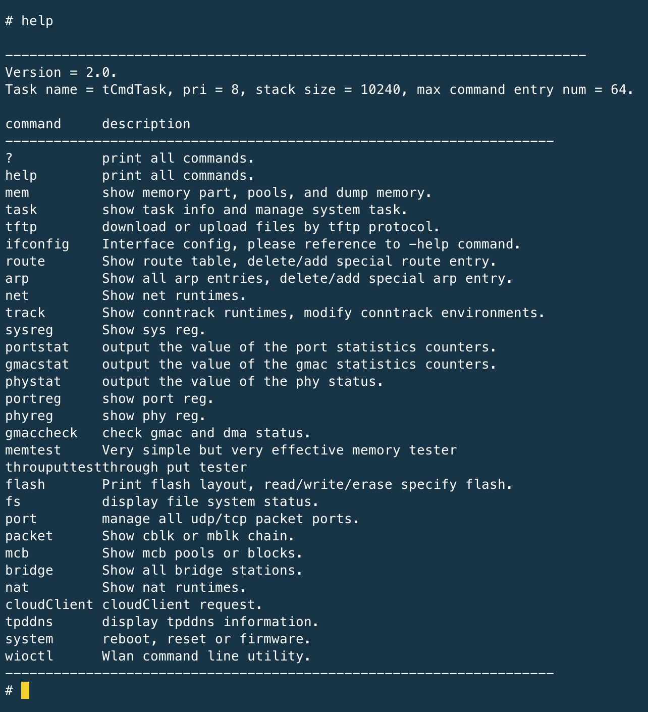
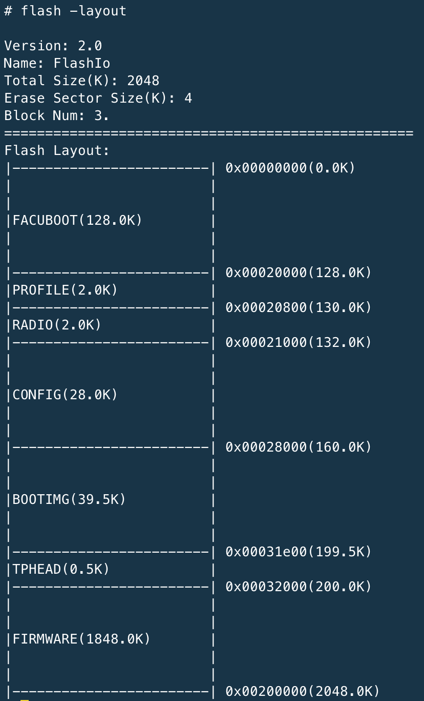

### Tools
1. RasberryPi 
2. Test Clip for SPI

### Target Board for Lab Exercise
1. TL-WR886N - For UART and SPI data extraction
2. TL-WR1043ND - For UART and JTAG

### Lab Exercise for SPI Flash Data Extraction
Step 1: Attach the test clip according to the RasberryPi SPI configuration.
Using GPIO 19, 21, 23 and 24 only

 

Step 2: Use the test clip and connect it to the TL-WR886N SPI chip

 

>[!INFO]
>This is a SPI Flash GD25Q16C (2MB) and their pinouts
> Connect WP and HOLD pins to VCC

 

 

Step 3: Using flashrom to extract from SPI
>$sudo flashrom -p linux_spi:dev=/dev/spidev0.0,spispeed=8000 -r spi_flash.bin

 

### Lab Exercise to Access UART
UART pinouts of TL-WR886N

 

UART pinouts of TL-WR1043ND

 

Step 1: Rasberry Pi UART configuration, follow the pinout and connect to the transmit and receive pins of the UART idenitfied on the target

 

Step 2: Use minicom tool to interact with the OS

>$ minicom -s /dev/ttyS0  
115200 8N1  
Pi Pinout: Pin 8 (Tx)  Pin 10 (Rx)

UART Shell

 

Command to display the flash Layout

 
